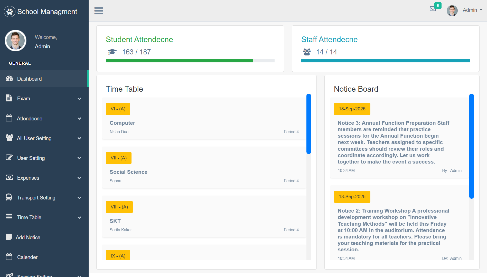
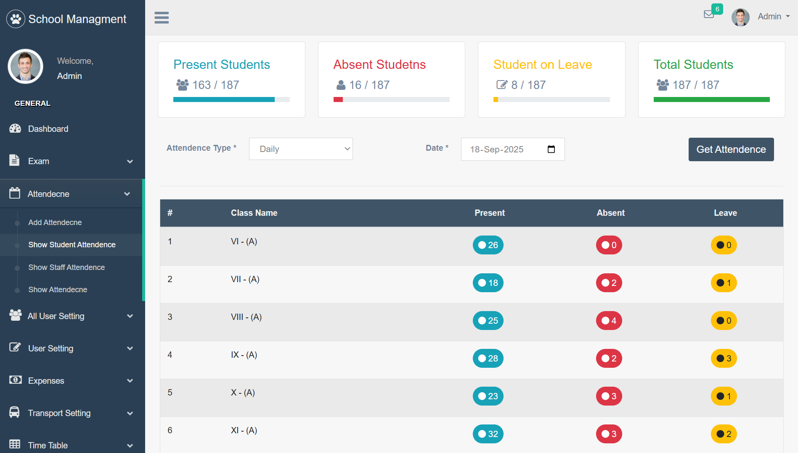
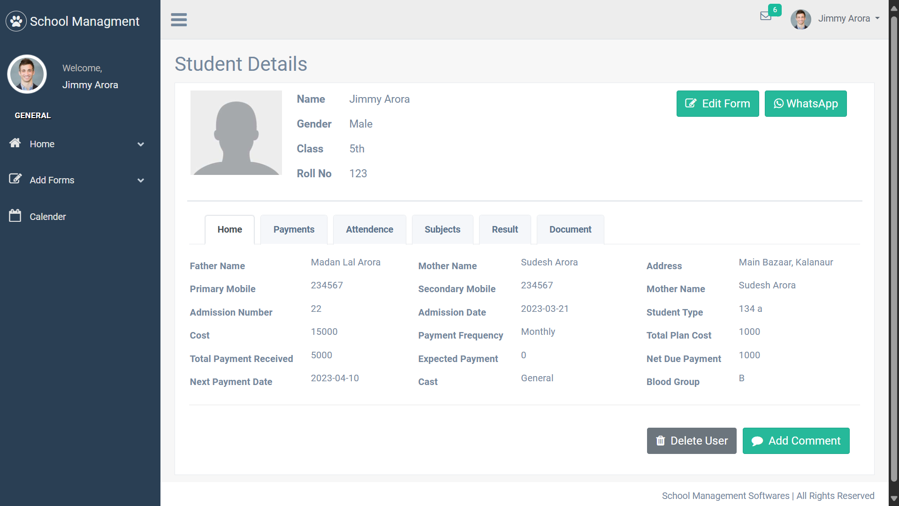

# School Management Dashboard 🏫  
A web-based **School Management System** built with **Flask** and **PostgreSQL**.  
It was designed to manage students, teachers, fees, and attendance in one dashboard.  

⚠️ **Note:** This project is not a fully finished product.  
Some features were removed or never fully implemented due to technical decision challenges at the time.  
However, it still demonstrates key concepts for building a structured Flask application.  

---

## 🚀 Features Implemented  
- **User Authentication** – Role-based login for admin, teachers, and students.  
- **Student & Teacher Management** – Add, update, and manage profiles.  
- **Attendance Tracking** – Record and view daily attendance.  
- **Fee Management** – Track fee status for each student.  
- **Basic Admin Dashboard** – Overview of core activities.  

---

## 🛠️ Tech Stack  
- **Backend:** Flask (Python)  
- **Database:** PostgreSQL  
- **Frontend:** HTML, CSS, JavaScript (Bootstrap)  
- **Other Tools:** Flask-Login, SQLAlchemy ORM, SSE (server side Events)

---

## 📸 Screenshots  
| Dashboard | Attendance | Student Profile |  
|-----------|------------|----------------|  
|  |  |  |  


---

## 🔑 How It Works  
1. Admin logs in and manages students, teachers, and fees.  
2. Teachers can take attendance and update student records.  
3. Students (or their guardians) can view attendance and fee status.  

---

## 🧩 Planned Features (Not Yet Implemented)  
I had a clear vision for expanding this system, but some parts were left incomplete.  
Planned improvements include:  
- **Timetable Management** – Class scheduling system.  
- **Grade Reports** – Student performance tracking.  
- **Parent Portal** – Separate login for parents to view their child’s progress.  
- **Notifications** – Email/SMS alerts for fees, attendance, or exams.  
- **More Advanced UI** – Cleaner, modern interface.  

---

## 👨‍💻 My Role  
- Designed and built the **Flask backend** (routes, models, database integration).  
- Implemented **authentication, attendance, and fee modules**.  
- Structured the project with scalability in mind (Flask blueprints, modular design).  
- Maintained and improved the UI, though the initial design was basic and evolving.  
- Learned from this project how to make **better architectural decisions** for future apps.  

---

## 📈 Key Learning Outcomes  
- Gained hands-on experience with **Flask + PostgreSQL**.  
- Learned the importance of **planning features vs coding them directly**.  
- Improved understanding of **scalable app structure** and decision-making trade-offs.  

---

## ⚙️ Installation & Setup  

Clone the repo:  
```bash
git clone https://github.com/guru-sevak-singh/school-management
cd school-management
